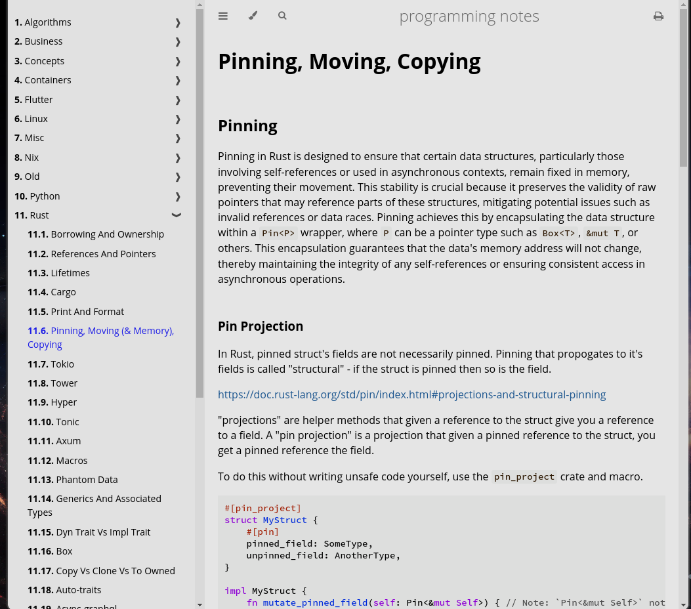

# mdbook-tools
`mdbook-tools` is a flexible cli tool for organizing files and creating mdbooks. Combining `mdbook-tools` and `mdbook` allows you to embed documentaion directly into your project structure or maintain a completely seperate set of documentation or notes.


### Example Using mdbook-tools To Maintain Notes
For a directory structure like
```
...
├── python
│   ├── 01_venv.md
│   ├── 02_pip_vs_python_-m_pip.md
│   ├── 03_venv.md
│   ...
│   └── README.md
├── rust
│   ├── 01_borrowing_and_ownership.md
│   ├── 02_references_and_pointers.md
│   ├── 03_lifetimes.md
│   ├── 04_cargo.md
│   ├── 05_print_and_format.md
│   ├── 06_pinning,_moving_(&_memory),_copying.md
│   ├── 07_tokio.md
│   ├── 08_tower.md
│   ...
│   └── README.md
...
```
Running
```bash
mdbook-tools summary --include-unnumbered-directories
mdbook serve
```
Will give you:


### CLI Preview
```
mdbook tools for organizing books.


Usage: mdbook-tools <COMMAND>

Commands:
  summary   
                The 'summary' command automates the generation of a structured summary file.
                It sequentially reads numbered md files and directories (e.g., "0001_") to define their order in the summary. 
                If any md files or directories do not have a number, they are ignored by default. 
                Directories use their 'README.md' file to define their content in the summary. As such, directories without a 'README.md' are ignored,
                but the descendants are still searched.
                Numbering resets for each directory, reflecting their hierarchical structure in the summary.
                'README.md' files are exempt from numbering.
                Section headers are created by removing underscores and capitalizing the first letter of each word.
                Section names exclude numeric prefixes.
                
  mv        
                The 'mv' command facilitates reorganizing md files or directories within the book's structure. 
                It allows moving a file or directory to a specified position (index) in a different directory. 
                The index numbering starts at 1, with 'README.md' is exempt.
                When a file is moved to an occupied index, the existing file or directory, and those following it,
                are automatically shifted down to accommodate the new file or directory, and the original directory is updated as well.
                Summary is not updated.
                
  re-order  
                Re-orders all the existing files in the path. Any gaps in the current order are collapsed and the new level is applied.
                e.g. ["001_..", "003_.."] for level 2 becomes ["01_", "02_"].
                
  help      Print this message or the help of the given subcommand(s)

Options:
  -h, --help     Print help
  -V, --version  Print version
```


### Useful Bash Commands For Migration Over To mdtools-tools
Replace all spaces in files and directories (including sub-directories) names with underscore
```bash
find . -depth -name '* *' -execdir bash -c 'mv "$1" "${1// /_}"' bash {} \;
```
Rename every file and directory to their lowercase equivalent, recursively.
```bash
find . -depth -exec bash -c '
    for item; do
        dir=$(dirname "$item")
        base=$(basename "$item")
        lower=$(echo "$base" | tr '[:upper:]' '[:lower:]')
        if [ "$base" != "$lower" ]; then
            mv -T "$item" "$dir/$lower"
        fi
    done
' bash {} +
```